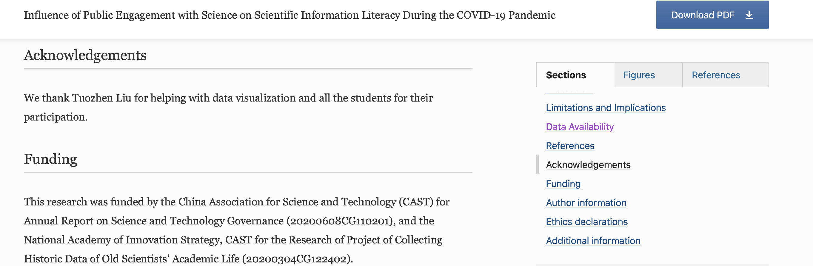
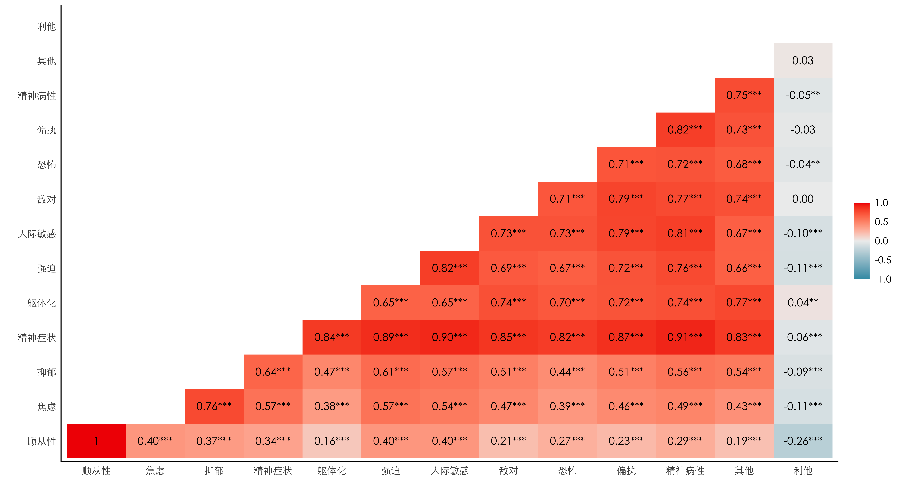
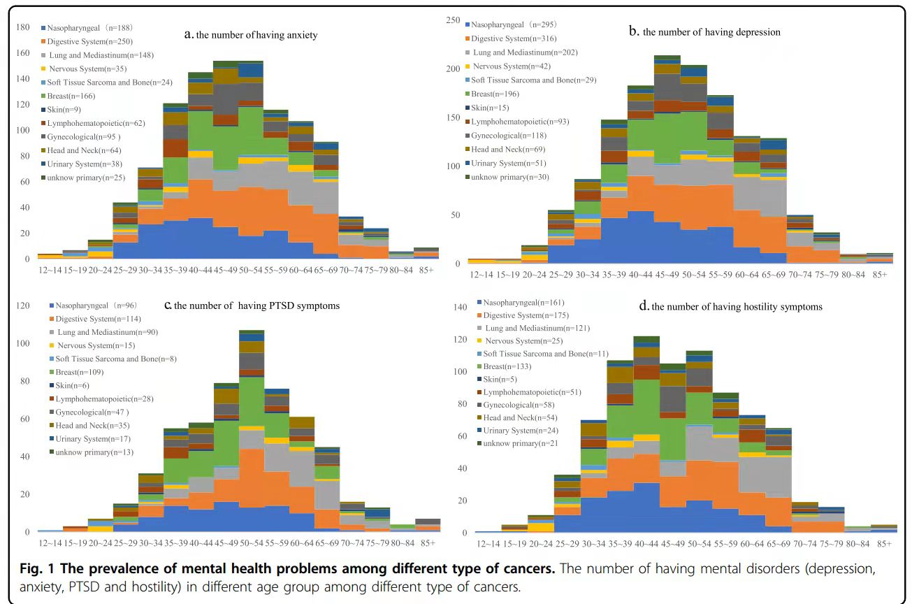
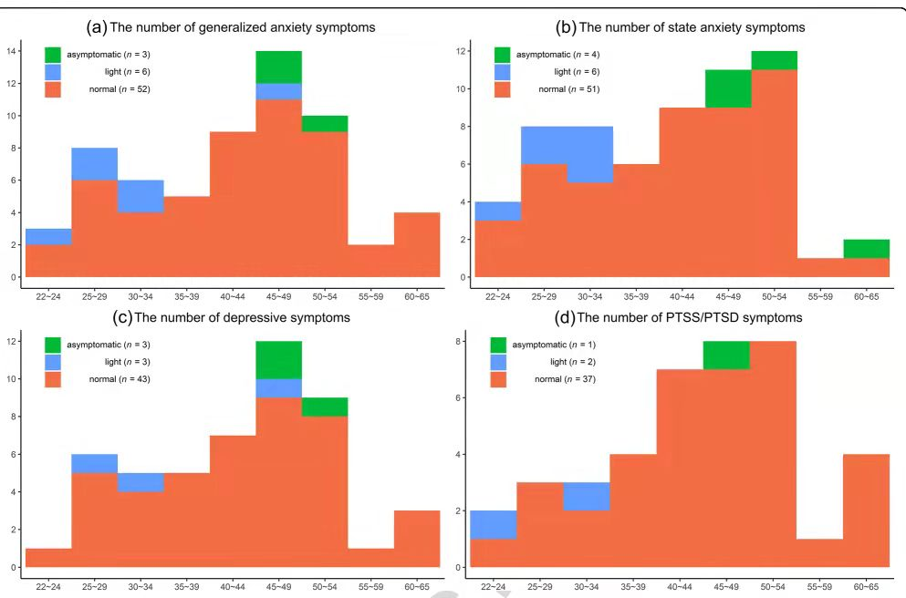
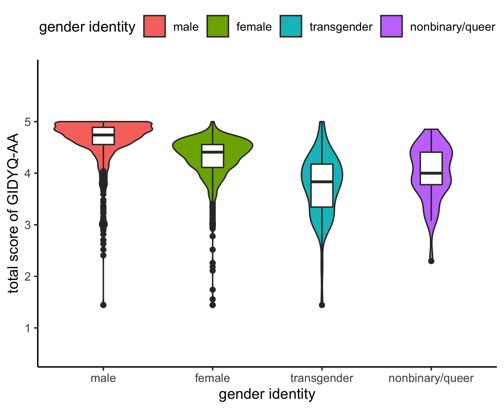
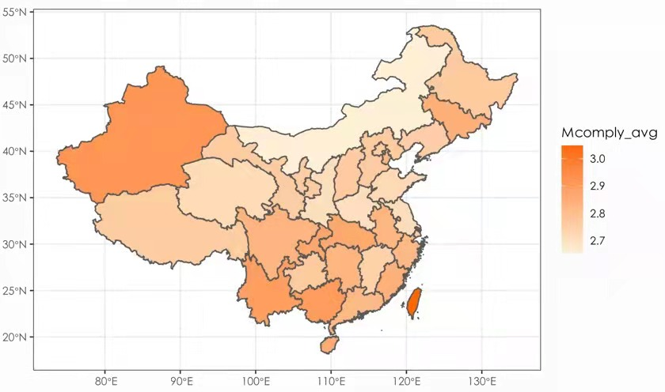

# Psychological-Visualization

Data Processing & Visualization scripts for published Psychological papers.

## Published Papers

[Influence of Public Engagement with Science on Scientific Information Literacy During the COVID‑19 Pandemic](https://link.springer.com/article/10.1007/s11191-021-00261-8)

- Globalization and Health
- 2021-12 | Journal article
- DOI: 10.1186/s12992-021-00694-4

[Prevalence of psychiatric diagnosis and related psychopathological symptoms among patients with COVID-19 during the second wave of the pandemic](https://globalizationandhealth.biomedcentral.com/articles/10.1186/s12992-021-00694-4#Ack1)

- Science & Education
- 2021-08-30 | Journal article
- DOI: 10.1007/s11191-021-00261-8

[Prevalence of PTSD Symptoms Among Psychiatric Patients During the COVID-19 Pandemic](https://www.researchsquare.com/article/rs-139931/v1)

- 2021-01-07 | Other
- DOI: 10.21203/rs.3.rs-139931/v1

## Some Plots
- Correlation Plot

- Group Hist Plot

- Violin Plot

- Map Plot

  
 

 
 
